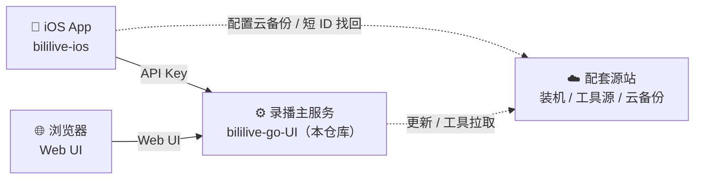

<div align="center">

# 🎬 bililive-go 优化版

**一个挂着就能自动录直播、还自带视频库和播放器的录播工具**

录抖音、B站、斗鱼…… 主播一开播自动开录，录完直接在网页里看，手机上也能刷。

[](https://github.com/xuyuanzhang1122/bililive-go-UI/releases)
[](https://hub.docker.com/r/xuniubi/bililive-go)
[](https://github.com/xuyuanzhang1122/bililive-go-UI/actions)
[](LICENSE)

[快速开始](#-30-秒上手) · [功能特性](#-能做什么) · [iOS App](#-ios-app) · [配置说明](#%EF%B8%8F-配置说明) · [常见问题](docs/FAQ.md)

🌐 **官方源站（可选）**：[image.xumy.art](https://image.xumy.art) —— 一站式安装入口、国内加速镜像与工具分发

</div>

---

## 👋 这是什么

基于原版 [bililive-go](https://github.com/bililive-go/bililive-go) 深度魔改的直播录制工具。原版只管录，这个版本把"录完之后"的事也做了：

- 📺 **自带视频库和播放器** —— 录好的视频按主播归类，点开就在浏览器里放，不用下载、不用找文件
- 📱 **配套 iOS App** —— 躺床上用手机刷录播，进度还能和网页端同步
- 🔑 **一键鉴权** —— 公网部署也不怕被白嫖，开个 API Key 就行
- 🚀 **一行命令装好** —— 自动搞定 ffmpeg、无头浏览器这些依赖，装完就能用

> 💡 项目最初是为了自用录抖音做的，所以**抖音支持最完整**；B站、斗鱼、虎牙等其他平台沿用上游能力，可用但不保证每个都完美。

---

## 🚀 30 秒上手

打开终端，粘贴一行命令，按提示回车就行（Linux / macOS / WSL）：

```bash
# 作者源（国内速度快，自动处理依赖）
curl -fsSL https://image.xumy.art/install.sh | bash
```

```bash
# 或者走 GitHub 官方源
curl -fsSL https://raw.githubusercontent.com/xuyuanzhang1122/bililive-go-UI/main/scripts/install.sh | bash
```

脚本会带你走一遍：**检测系统 → 选安装方式 → 确认目录和端口 → 自动装依赖 → 体检自检**，全程回车默认即可。装完浏览器打开 `http://你的IP:8080` 就是控制台。

<details>
<summary>📦 想自定义？看这里（非交互 / Docker / 全部参数）</summary>

<br>

**一键全默认（适合服务器 / CI）：**

```bash
curl -fsSL https://image.xumy.art/install.sh | bash -s -- --yes --port 8080 --enable-api-key
```

**用 Docker 装：**

```bash
curl -fsSL https://image.xumy.art/install.sh | bash -s -- --docker --port 8080
```

**全部参数：**

| 参数 | 说明 |
|------|------|
| `--binary` | 装预编译二进制（**默认**，不需要 Docker） |
| `--docker` | 用 Docker 容器跑 |
| `--source URL` | 指定安装源（作者源 / GitHub / 自建源） |
| `--dir PATH` | 安装目录，默认 `~/bililive-go` |
| `--videos-dir PATH` | 视频目录，可指向已有的老录播位置 |
| `--port N` | 网页端口，默认 `8080` |
| `--enable-api-key` | 开启鉴权并自动生成随机 Key |
| `--api-key STR` | 手动指定 Key |
| `--version TAG` | 装指定版本 |
| `--yes` / `-y` | 全程不询问，走默认值 |

> 🪟 **Windows 用户**：用 PowerShell 跑 `irm https://image.xumy.art/install.ps1 | iex`

</details>

<details>
<summary>🐳 想手动玩 Docker？看这里</summary>

<br>

> ⚠️ **务必挂满三条 volume**。少挂 `Data` 那条，重启后直播间列表和缩略图会全没。

```bash
mkdir -p ~/bililive-go/{Videos,Data} && cd ~/bililive-go

# 拉配置模板
curl -fsSL https://raw.githubusercontent.com/xuyuanzhang1122/bililive-go-UI/main/config.docker.yml -o config.docker.yml

docker run -d \
  --name bililive-go \
  --restart unless-stopped \
  -p 8080:8080 \
  -v $(pwd)/Videos:/srv/bililive \
  -v $(pwd)/Data:/var/lib/bililive \
  -v $(pwd)/config.docker.yml:/etc/bililive-go/config.yml \
  xuniubi/bililive-go:latest
```

**Docker Compose：**

```bash
curl -fsSL https://raw.githubusercontent.com/xuyuanzhang1122/bililive-go-UI/main/docker-compose.yml -o docker-compose.yml
curl -fsSL https://raw.githubusercontent.com/xuyuanzhang1122/bililive-go-UI/main/config.docker.yml -o config.docker.yml
mkdir -p Videos Data
docker compose up -d
```

> 需要抖音等短链解析时，把镜像 tag 换成 `:full`（内置 Chromium 无头浏览器，体积更大）。

</details>

---

## ✨ 能做什么

### 🎥 录制

- **挂机自动录**：主播开播自动开录，下播自动停，不用守着
- **多平台**：抖音、B站、斗鱼、虎牙、Acfun、CC、OPENREC、猫耳、微博、YY……
- **抖音短链直接贴**：分享文案、短链、reflow 链接都能自动解析成直播间，解析不了再用无头浏览器兜底
- **画质可选**：原画 / 原画 PRO（HEVC，体积省 35%）

### 📺 看录播

- **视频库首页**：按平台和主播归类，每个卡片配自动生成的封面缩略图
- **网页直接放**：FLV / TS / MP4 / MKV / MOV 内嵌播放，不用下载不用跳转
- **进度自动记**：每 10 秒存一次，下次打开同一个视频接着上次的地方看
- **手势操作**：左右滑快进快退、长按 2 倍速、单击显隐控制栏、双击暂停

### 🔐 安全与管理

- **API Key 鉴权**：网页设置页一键开启，热生效不用重启；多用户各自的历史和进度互不串
- **一键清理碎片**：断流重连会留下小碎片视频，一键列出小于 50MB 的文件，确认后再删
- **删直播间连带删视频**：可选把该主播的录像一起清掉

---

## 📱 iOS App

> 代码在独立仓库 **[bililive-ios](https://github.com/xuyuanzhang1122/bililive-ios)**。
> Releases 页有自动构建的 `.ipa`，用 AltStore / Sideloadly 个人签名装；或 Xcode 16+ 自己编译。

<div align="center">

| 看录播 | 管直播间 | 备份找回 |
|:---:|:---:|:---:|
| 视频库 + 内嵌播放器 | 增删直播间、批量删文件 | 配置打包上云，换机凭 ID 找回 |

</div>

- 🧊 **Liquid Glass 设计**：毛玻璃质感 UI + 全局触觉反馈，适配 iOS 26
- 🎮 **播放器手势**：横滑 seek、竖滑调音量/亮度、双击暂停、长按侧边下拉锁定 2 倍速、倍速菜单
- 📺 **画中画**：基于 [pillarbox-apple](https://github.com/SRGSSR/pillarbox-apple) 定制
- 📶 **智能网络切换**：自动判断在不在局域网，在家用内网地址、在外用公网地址
- ☁️ **备份与找回**：服务器配置 + 直播间列表打包，存手机本地或上传云端拿短 ID，重装后一键还原并自动重启同步

---

## ⚙️ 配置说明

<details>
<summary>📄 config.yml 关键项</summary>

<br>

```yaml
rpc:
  enable: true
  bind: :8080                   # 网页端口

security:
  enable_api_key: false         # 公网 / iOS 接入建议开启
  api_key: ""                   # 留空自动生成 32 字节随机串
  signed_url_ttl_seconds: 3600  # 签名 URL 有效期

out_put_path: ./recordings      # 视频输出目录（Docker 内是 /srv/bililive）
app_data_path: .appdata         # 数据库 + 缩略图（Docker 内是 /var/lib/bililive）

ffmpeg_path: ""                 # 留空自动找 PATH

headless_browser:               # 抖音短链解析用
  path: ""                      # 留空自动检测
  auto_install: true
  timeout_seconds: 15

douyin:
  cookie: ""                    # 录需要登录的房间时填

update:
  auto_check: true
  source_url: ""                # 填你的源站后，更新走源站镜像；留空走 GitHub
```

</details>

<details>
<summary>🔑 怎么开启 API Key</summary>

<br>

两种方式，效果一样：

- **网页一键**：打开服务 → 设置 → API Key → 点「立即启用并生成」，热生效不用重启
- **改配置**：把 `security.enable_api_key` 改成 `true`，填好 `api_key`，重启服务

</details>

<details>
<summary>🐳 Docker 挂载对照表</summary>

<br>

| 容器内路径 | 用途 | 主机侧推荐 |
|------------|------|-----------|
| `/srv/bililive` | 录制视频 | `./Videos` |
| `/var/lib/bililive` | 数据库 + 缩略图 | `./Data` |
| `/etc/bililive-go/config.yml` | 配置 | `./config.docker.yml` |
| `/opt/bililive/tools` | 内置工具（只读） | 不用挂 |

</details>

---

## 🧩 项目生态

这套东西是三个仓库配合的，各管一摊：



| 仓库 | 状态 | 管什么 |
|------|------|--------|
| **bililive-go-UI**（本仓库） | ✅ 开源 | 录播主服务、Web UI、全部核心 API |
| **[bililive-ios](https://github.com/xuyuanzhang1122/bililive-ios)** | ✅ 开源 | iOS 原生 App |
| **配套源站** | 🔒 私有部署 | 装机脚本托管、ffmpeg/浏览器工具分发、iOS 配置云备份 |

> 📌 主服务的**录制、播放、历史、鉴权**全部不依赖配套源站，单独跑就能用。源站只是让"装依赖"和"配置云备份找回"更省心。
> 作者运营的公网实例：🌐 **[image.xumy.art](https://image.xumy.art)**（可选使用，也可自行部署）。

---

## 🛠️ 本地开发

<details>
<summary>展开开发指南</summary>

<br>

**前置依赖**：Go 1.22+ · Node.js 20.x · GNU Make 4.0+

```bash
git clone https://github.com/xuyuanzhang1122/bililive-go-UI.git
cd bililive-go-UI

make build-web dev      # 构建前端 + 启动后端开发版
make dev                # 仅启动后端（前端已构建）
make build-web          # 仅构建前端
make generate-web-api   # 路由变动后重新生成前端 API 表
make test               # 单元测试
make lint               # 代码检查

# 交叉编译
make dev PLATFORM=linux ARCH=amd64   # 产物在 bin/bililive-linux-amd64

# 安装无头浏览器（抖音短链兜底，可选）
npm install && npm run install:browser

# 跑一次健康自检
./bin/bililive-dev --doctor -c config.yml
```

</details>

---

## 📚 文档

| 文档 | 内容 |
|------|------|
| [CHANGELOG.md](CHANGELOG.md) | 版本变更历史 |
| [docs/curl-commands.md](docs/curl-commands.md) | curl 命令速查（安装 / API / Docker / systemd） |
| [docs/FAQ.md](docs/FAQ.md) | 常见问题 |
| [docs/API.md](docs/API.md) | 后端 API 参考 |
| [docs/notify.md](docs/notify.md) | Telegram / Email / ntfy 通知配置 |
| [docs/PROJECT.md](docs/PROJECT.md) | 完整架构与改动说明 |

---

## 🙏 致谢

本项目 Fork 自 [bililive-go/bililive-go](https://github.com/bililive-go/bililive-go)，并参考了 [you-get](https://github.com/soimort/you-get)、[ykdl](https://github.com/zhangn1985/ykdl)、[youtube-dl](https://github.com/ytdl-org/youtube-dl) 的流媒体抓取思路，以及[TikTokDownloader
](https://github.com/JoeanAmier/TikTokDownloader)的URL解析思路；iOS 播放器基于 [pillarbox-apple](https://github.com/SRGSSR/pillarbox-apple)。感谢所有上游作者。

<div align="center">

**觉得有用的话，点个 ⭐ Star 支持一下～**
**如果您有更好的意见或需求，亦或是发现了BUG欢迎提交issues**

</div>
