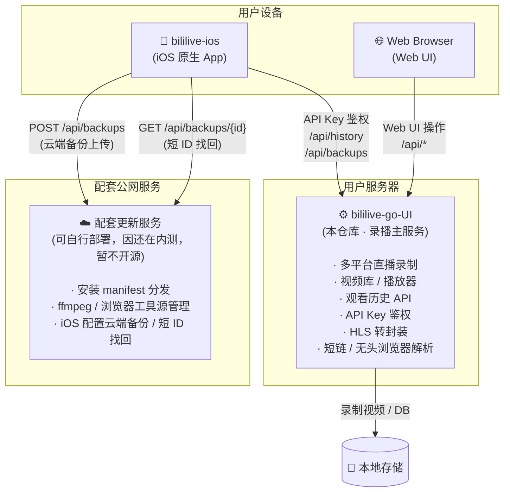

# bililive-go 优化版

[](https://github.com/xuyuanzhang1122/bililive-go-UI/actions/workflows/tests.yaml)
[](https://github.com/xuyuanzhang1122/bililive-go-UI/releases)
[](https://www.npmjs.com/package/bililive-go-ui)
[](https://hub.docker.com/r/xuniubi/bililive-go)

基于原版 [bililive-go](https://github.com/bililive-go/bililive-go) 深度优化的多平台直播录制工具。
新增视频库管理、内嵌播放器、服务端观看历史、API Key 鉴权、iOS 原生 App 接入，并完整覆盖 npm / Docker / 二进制三种交付方式。

---

## 项目生态

本项目是三仓库协作生态的核心，各组件职责清晰分离：



### 三仓库说明

| 仓库 | 状态 | 职责 |
|------|------|------|
| **bililive-go-UI**（本仓库）| ✅ 开源 | 录播主服务，Web UI，全部核心 API |
| **[bililive-ios](https://github.com/xuyuanzhang1122/bililive-ios)** | ✅ 开源 | iOS 原生客户端，需自行 Xcode 编译 |
| **配套更新/备份服务** | 🔒 私有部署 | 安装 manifest、工具源镜像、iOS 云端配置备份 |

### 当前可借助配套服务实现的功能

配套服务虽不开源，但通过标准 HTTP API 与主服务和 iOS 端协作，用户无需关心其内部实现即可获得以下能力：

| 功能 | 调用方 | API 端点 | 说明 |
|------|--------|----------|------|
| iOS 配置云端备份 | iOS App | `POST /api/backups` | 一键将服务器配置 + 直播间列表打包上传，返回短 ID |
| 短 ID 找回配置 | iOS App | `GET /api/backups/{id}` | 重装 App / 换机后输入 ID 恢复原配置 |
| 本地文件备份 | iOS App | 系统分享 | 同时导出一份 `.json` 包到手机本地，可自由分享 |

> **注意**：云端备份/找回功能需要 iOS App 在设置中配置好备份服务器地址（默认指向开发者运营的公网实例，或自行部署）。主服务的录播、历史、鉴权等核心功能均**无需**配套服务即可完整使用。

---

## 快速开始

### 方式一：curl 一键安装（Linux / macOS / WSL 推荐）

**交互模式（推荐）：**

```bash
curl -fsSL https://raw.githubusercontent.com/xuyuanzhang1122/bililive-go-UI/main/scripts/install.sh | bash
```

**非交互模式（CI / 服务器全默认）：**

```bash
curl -fsSL https://raw.githubusercontent.com/xuyuanzhang1122/bililive-go-UI/main/scripts/install.sh \
  | bash -s -- --yes --dir ~/bililive-go --port 8080 --enable-api-key
```

**Docker 部署：**

```bash
curl -fsSL https://raw.githubusercontent.com/xuyuanzhang1122/bililive-go-UI/main/scripts/install.sh \
  | bash -s -- --docker --dir ~/bililive-go --port 8080
```

安装脚本参数说明：

| 参数 | 说明 |
|------|------|
| `--binary` | 安装 GitHub Release 预编译二进制（**默认**，无需 Docker） |
| `--docker` | 使用 Docker 安装并启动容器 |
| `--dir PATH` | 安装目录，默认 `~/bililive-go` |
| `--port N` | Web UI 端口，默认 `8080` |
| `--version TAG` | 指定 GitHub Release tag |
| `--image TAG` | Docker 镜像 tag，默认 `latest`，仅 `--docker` 时生效 |
| `--enable-api-key` | 启用 API Key 并自动生成随机 Key |
| `--api-key STR` | 手动指定 API Key |
| `--yes` / `-y` | 非交互模式，所有配置走参数或默认值 |

### 方式二：npm 安装（已安装 Node.js 20+ 时）

```bash
# 交互安装
npm i bililive-go-ui
npx bililive-go-ui install

# 非交互安装
npm i bililive-go-ui
npx bililive-go-ui install --yes --dir ~/bililive-go --port 8080 --enable-api-key

# Docker 模式
npm i bililive-go-ui
npx bililive-go-ui install --docker

# 一次性运行（无需本地依赖）
npx -y bililive-go-ui@latest install
```

### 方式三：Docker 手动启动

> **重要**：必须同时挂载三条 volume。缺少 `Data` 会导致重启后直播间列表和缩略图全部丢失。

```bash
mkdir -p ~/bililive-go/{Videos,Data}
cd ~/bililive-go

# 下载配置模板
curl -fsSL https://raw.githubusercontent.com/xuyuanzhang1122/bililive-go-UI/main/config.docker.yml \
  -o config.docker.yml

# 启动容器
# 注意：若需使用短视频平台直播解析功能（如抖音），请将 tag 替换为 :full（内置 Chromium 无头浏览器，镜像体积较大）
docker run -d \
  --name bililive-go \
  --restart unless-stopped \
  -p 8080:8080 \
  -v $(pwd)/Videos:/srv/bililive \
  -v $(pwd)/Data:/var/lib/bililive \
  -v $(pwd)/config.docker.yml:/etc/bililive-go/config.yml \
  xuniubi/bililive-go:latest
```

**使用 Docker Compose（推荐）：**

```bash
# 下载 compose 文件和配置模板
curl -fsSL https://raw.githubusercontent.com/xuyuanzhang1122/bililive-go-UI/main/docker-compose.yml -o docker-compose.yml
curl -fsSL https://raw.githubusercontent.com/xuyuanzhang1122/bililive-go-UI/main/config.docker.yml -o config.docker.yml
mkdir -p Videos Data

docker compose up -d

# 指定镜像版本
BILILIVE_IMAGE=xuniubi/bililive-go:v1.3.1 docker compose up -d
```

容器默认端口：`8080`，录制文件输出到容器内 `/srv/bililive`（映射主机 `./Videos`）。

---

## 功能特性

### 核心能力

- **多平台录制**：抖音、B站、斗鱼、虎牙、Acfun、CC、OPENREC、猫耳、微博、YY 等
- **视频库首页**：按平台/主播聚合展示，卡片封面使用自动生成的缩略图
- **内嵌播放器**：支持 FLV、TS、MP4、MKV、MOV，无需跳转外部页面
- **服务端观看历史**：`GET/POST /api/history`，跨设备同步播放进度，不依赖浏览器 localStorage
- **API Key 鉴权**：Web UI 设置页一键启用并生成，无需重启容器；iOS App 粘贴即用
- **短链解析**：抖音短链 HTTP 解析失败后自动用无头浏览器（Playwright）兜底

### Web 播放器

- 自动保存播放进度（每 10 秒同步到服务端），下次打开同一文件直接续播
- 移动端手势：左右滑动快进快退、长按 2x 加速、单击显隐控制栏、双击播放暂停
- 继续观看横幅：视频库首页顶部展示上次观看记录

### iOS App

> iOS 端代码位于独立仓库 **[bililive-ios](https://github.com/xuyuanzhang1122/bililive-ios)**。
> 可从 Releases 页下载自动构建的 `.ipa`，使用 AltStore / Sideloadly 个人签名安装；或 Xcode 16+ 自行编译。

- 视频库、直播间管理、文件单个/批量删除
- **Glassmorphism 全新设计**：毛玻璃质感 UI + Taptic Engine 全局触觉反馈
- 播放器手势：横滑 seek、竖滑音量、双击播放暂停、长按侧边 2x 加速、倍速菜单（0.78x / 1x / 1.25x / 1.5x / 2x）
- 画中画（PiP）支持，基于 [pillarbox-apple](https://github.com/SRGSSR/pillarbox-apple) 深度定制
- 智能网络切换：自动探测局域网/公网，局域网内优先用局域网地址
- 服务端观看历史：历史 Tab 展示播放进度，支持续播跳转
- **多用户 API Key 鉴权**：各客户端数据（历史、进度）严格隔离互不干扰
- **一键备份与恢复**：导出服务器配置 + 直播间列表到本地文件，或上传到云端获取短 ID，重装 App 后输入 ID 一键找回

### 文件管理

- 删除直播间时可同步删除该主播全部录制视频
- 文件列表支持单个删除和批量删除
- 文件页只展示录制相关目录，避免 `out_put_path` 指向项目目录时暴露源码

---

## 配置说明

### 关键配置项（`config.yml` / `config.docker.yml`）

```yaml
rpc:
  enable: true
  bind: :8080                   # Web UI 监听端口

security:
  enable_api_key: false         # iOS App / 公网访问时建议改为 true
  api_key: ""                   # 为空时自动生成 32 字节随机串
  signed_url_ttl_seconds: 3600  # 签名 URL 有效期（秒）

out_put_path: ./recordings      # 视频输出目录（Docker 内为 /srv/bililive）
app_data_path: .appdata         # DB + 缩略图（Docker 内为 /var/lib/bililive）

ffmpeg_path: ""                 # 留空则自动搜索 PATH

headless_browser:               # 抖音无头浏览器解析
  path: ""                      # 留空则自动检测环境变量 / PATH
  auto_install: true
  timeout_seconds: 15

douyin:
  cookie: ""                    # 抖音 Cookie（录制需要登录的房间时配置）

cookies:
  live.douyin.com: "__ac_nonce=xxx;name=value"  # 平台级 Cookie
```

### 启用 API Key（推荐）

两种方式等效：

- **Web UI 一键启用**：浏览器打开服务 → 设置 → API Key → 点击「立即启用并生成」，热加载生效，无需重启。
- **手动编辑配置**：修改 `config.yml` 中 `security.enable_api_key: true` 和 `api_key` 字段后重启服务。

### Docker 挂载说明

| 容器内路径 | 说明 | 主机侧推荐路径 |
|------------|------|----------------|
| `/srv/bililive` | 录制视频输出目录 | `./Videos` |
| `/var/lib/bililive` | 数据库 + 缩略图 | `./Data` |
| `/etc/bililive-go/config.yml` | 配置文件 | `./config.docker.yml` |
| `/opt/bililive/tools` | 内置工具（只读） | 无需挂载 |

---

## Docker 镜像构建

### 从源码构建

```bash
docker build \
  --build-arg VERSION=v1.3.1 \
  -t xuniubi/bililive-go:v1.3.1 \
  .

# 多架构（amd64 + arm64）并推送
docker buildx build \
  --platform linux/amd64,linux/arm64 \
  --build-arg VERSION=v1.3.1 \
  -t xuniubi/bililive-go:v1.3.1 \
  --push \
  .
```

### 从本地预编译二进制封装

```bash
# amd64
docker build --platform linux/amd64 -f Dockerfile.local -t xuniubi/bililive-go:local .

# arm64
docker build \
  --platform linux/arm64 \
  --build-arg BILILIVE_BINARY=bililive-linux-arm64 \
  -f Dockerfile.local \
  -t xuniubi/bililive-go:local-arm64 \
  .
```

---

## 本地开发

### 前置依赖

| 工具 | 版本要求 |
|------|----------|
| Go | 1.22+ |
| Node.js | 20.x |
| GNU Make | 4.0+ |
| Git | 任意稳定版本 |

### 常用命令

```bash
# 克隆
git clone https://github.com/xuyuanzhang1122/bililive-go-UI.git
cd bililive-go-UI

# 构建前端 + 启动后端开发版
make build-web dev

# 仅启动后端开发版（前端已构建）
make dev

# 仅构建前端
make build-web

# 自动生成前端 API 调用表（路由变动后需执行）
make generate-web-api

# 安装无头浏览器（可选，抖音短链解析兜底）
npm install
npm run install:browser

# 单元测试
make test

# 代码检查
make lint

# 交叉编译 Linux 二进制
make dev PLATFORM=linux ARCH=amd64
# 生成物位于 bin/bililive-linux-amd64
```

---

## 相关文档

- [CHANGELOG.md](CHANGELOG.md) — 版本变更历史
- [docs/curl-commands.md](docs/curl-commands.md) — **curl 命令速查手册**（安装、API、Docker、systemd 全覆盖）
- [docs/FAQ.md](docs/FAQ.md) — 常见问题
- [docs/API.md](docs/API.md) — 后端 API 参考
- [docs/notify.md](docs/notify.md) — Telegram / Email / ntfy 通知配置
- [docs/PROJECT.md](docs/PROJECT.md) — 完整架构与改动说明

## 协作项目

| 项目 | 链接 | 说明 |
|------|------|------|
| iOS 原生客户端 | [bililive-ios](https://github.com/xuyuanzhang1122/bililive-ios) | 专属 iOS App，Releases 提供自动构建 IPA |
| 原版 bililive-go | [bililive-go/bililive-go](https://github.com/bililive-go/bililive-go) | 本项目 Fork 来源 |
| pillarbox-apple | [SRGSSR/pillarbox-apple](https://github.com/SRGSSR/pillarbox-apple) | iOS 播放器底层依赖 |
| you-get / ykdl / youtube-dl | 见各自 GitHub | 参考的流媒体抓取方案 |

## 参考项目

- [原版 bililive-go](https://github.com/bililive-go/bililive-go)
- [you-get](https://github.com/soimort/you-get)
- [ykdl](https://github.com/zhangn1985/ykdl)
- [youtube-dl](https://github.com/ytdl-org/youtube-dl)
